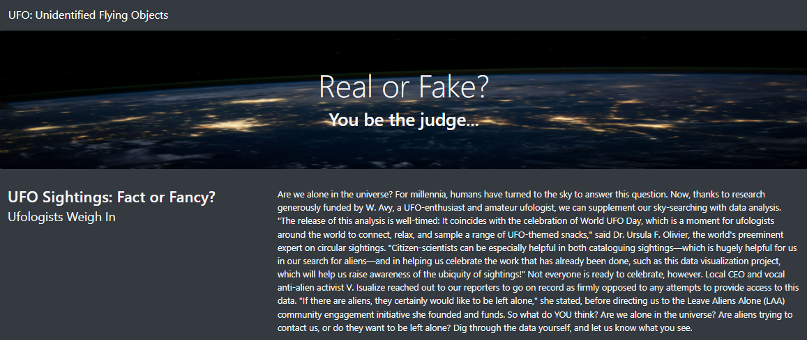
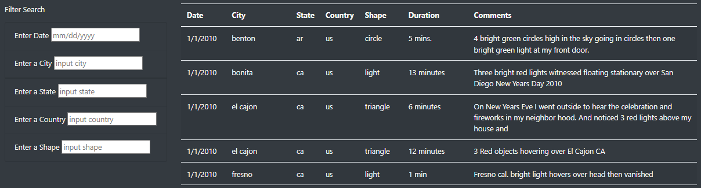
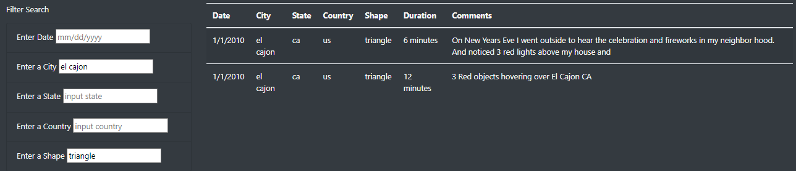

# UFO Tracking

### Purpose:
Use JavaScript, HTML and CSS to create a webpage with a dynamic table that can be filtered for multiple criteria simultaneously, and is updated in real-time as filters are added/removed/edited.

# Functionality:
When users arrive to the webpage, the first thing they'll see is a high-resolution image taken from space, accompanied by an article regarding the existence of UFOs. 

Following this, our webpage pulls from our JavaScript data file and compiles a table with all known UFO sightings including the date of the sighting, the city, state, and country of sighting, the shape of the object, duration of sighting, and any comments made by the observer. To the left of this table, we have also included a number of (labeled) input boxes so that users can filter the table for specific dates, locations, and object shapes. 

As users input their filtering criteria, the table will dynamically update after each input, and display only the information relevant to the user's search criteria.

### Closing Thoughts:
One drawback with removing the "filter" button from our web application is that users who are less computer-savy may not know to press "enter" or "tab" in order to run the filter. One easy way to mitigate this is by adding a tooltip either near the filtering area, or one that pops up when a user's cursor is hovering over the input fields.

#### Further Development
In order to further improve our webpage, our next steps could be to make the filters more flexible (capture date ranges rather than single dates, or allow case insensitivity). Another improvmement could be to introduce additional fields (eg: 'color' or 'brightness') or tags (eg: #loudnoise, #brightflashes) that users would be able to filter by.